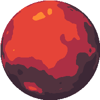
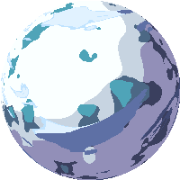
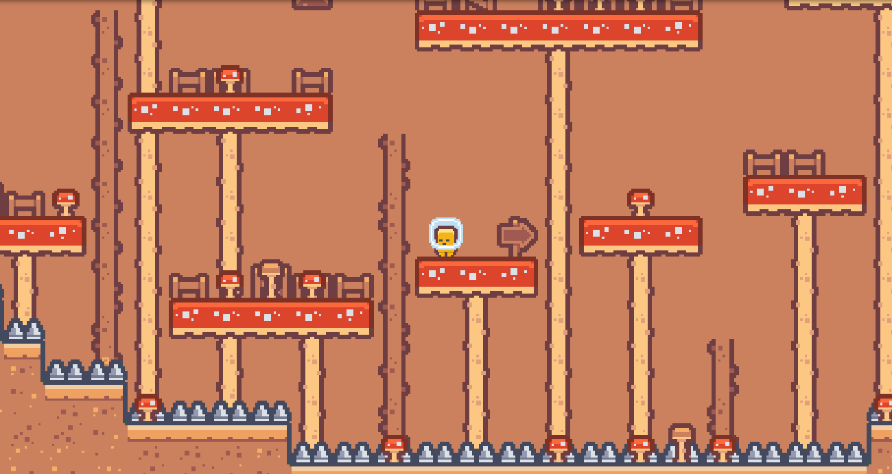
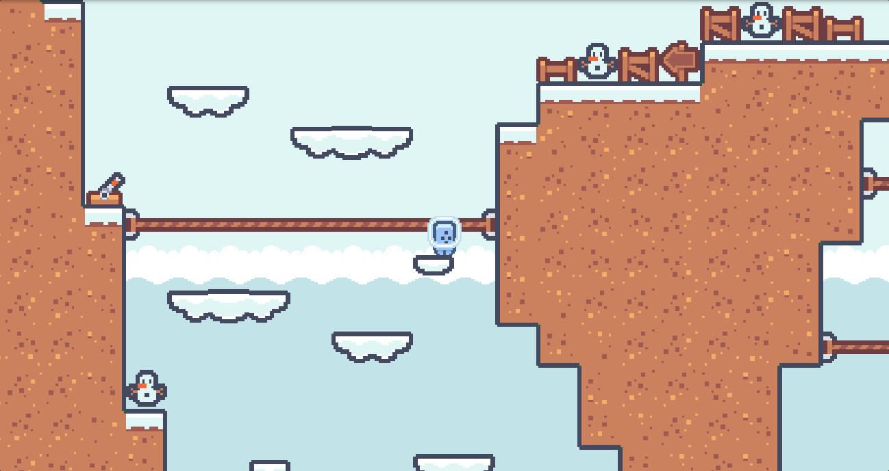
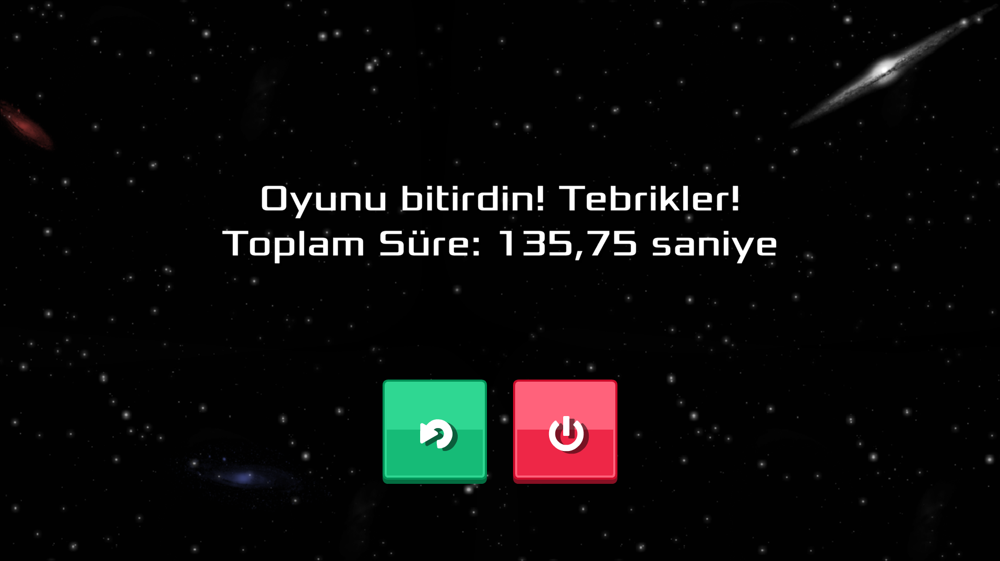

<!---

--->

# Ürün İle İlgili Bilgiler

Speedrun, Pixel, Platformer, [(WebGL) üzerinden oynayabilirsiniz](https://play.unity.com/en/games/192fbe56-6826-4dff-ada9-d010c83667a0/cosmic-rush)

- Gülizar Rabia Çakan: Developer

## Ürün İsmi

Cosmic Rush

## Ürün Açıklaması

- Uzay gemisinde oturmaktan sıkılmış 3 uzaylı arkadaş, o sırada yanından geçtikleri gezegenleri keşfetmek için birbirleri arasında, kimin daha hızlı keşfedeceği üzerine iddiaya girerler. Her gezegenin kendi atmosferine göre (oyuncu kontrol) zorluğu vardır. Bakalım sen ne kadar sürede hepsini keşfedebileceksin?

## Ürün Özellikleri

- Pixel
- Platformer
- Speedrun
- 3 Farklı gezegen bölümü
- Her gezegene özel oyuncu kontrol zorluğu

## Hedef Kitle

- 10-35 yaş arası kullanıcılar
- Bilim Kurgu Temasına ilgi duyanlar
- Gamer Komüniteleri ve Forumlar
- Speedrun severler

## Product Backlog URL

[Trello](https://trello.com/b/9zvnilY9/cosmic-rush-from-time-guards)

- **Sprint içinde tamamlanması tahmin edilen puan**: 10 Puan

- **Puan tamamlama mantığı**: Trello tablosunda tamamlanan her görev için 2 puan geçerli olacaktır. Toplamda proje boyunca tamamlanması gereken 30 puanlık backlog bulunmaktadır. 3 sprint'e bölündüğünde ilk sprint'in en azından 10 ile başlaması gerektiğine karar verildi.

- **Daily Scrum**: Daily Scrum toplantılarının zamansal sebeplerden ötürü WhatsApp ve Discord üzerinden yapılmasına karar verilmiştir. Daily Scrum toplantısı örneği aşağıda ekran görüntüsü olarak paylaşılmaktadır.

  - 

    
<strong>📸 Daily Scrum ekran görüntüleri için tıkla!</strong>

    
    
    
    
  

  - 

    
<strong>📸 Sprint Board ekran görüntüleri için tıkla!</strong>

- **Ürün Durumu:**

İlk Hali | Yenilenmiş Hali
:-: | :-:
<video src="https://github.com/hhhhh-ckr/OUA-Bootcamp-Grup87/assets/85761842/61845bdc-bd8d-43df-b1e0-c1ec8ea19693"></video> | <video src="https://github.com/hhhhh-ckr/OUA-Bootcamp-Grup87/assets/85761842/67e32f68-86fd-4576-bc42-e42124915dad"></video>

- **Sprint Review:**
  - **Alınan kararlar**: Oyunun üretiminin planlı ilerlemesi için ekip üyelerinin her birine 2 adet gezegen tasarımı verilmiştir. Fakat bir yandan da oyunun ilerlemesi için yeterli olmamıştır. O sebeple tasarım dağılımı  bir sonraki sprint'e aktarılmıştır. Çıkan ürünün çalışmasında ve testlerinde bir problem görülmemiştir. Ekstra koyulması gereken özellikler belirlenmiştir.

  - **Sprint Review katılımcıları**: Gülizar Rabia Çakan ve Hazar Çakar

- **Sprint Notları**: Oyunun içeriği trello tablosu ile product backlog'ların içine yazılmıştır. Product backlog item'lara tıklandığında oyunun detayları okunabilir.

- **Sprint içinde tamamlanması tahmin edilen puan**: 10 Puan

- **Puan tamamlama mantığı**: Trello tablosunda tamamlanan her görev için 2 puan geçerli olacaktır. 3 sprint'e bölündüğünde ikinci sprint'in en azından 10 ile devam etmesi gerektiğine karar verildi.

- **Backlog düzeni ve Story seçimleri**: Backlog'umuz ilk yapılacak story'lere göre düzenlenmiştir. Sprint başına tahmin edilen puan sayısını geçmeyecek şekilde sıradan seçimler yapılmaktadır. Story başına çıkan tahmin puanı, toplam puanın yarısından az tutulmuştur.
oyun ile ilgili blacklog düzeni ve story seçimleri trello tablosunda açık bir şekilde belirtilmiştir.

  - 

    
<strong>📸 Sprint Board ekran görüntüleri için tıkla!</strong>

    

- **Ürün Durumu:**

Yenilenmiş Hali | Bazı Assetler
:-: | :-:
 | 

- **Ürün Durumu:**

Gezegen Tasarımları | Bölüm Tasarımları
:-: | :-:
   |   
Oynanış videosu | Oyun bitiş sahnesi
 | 

- **Sprint Review:**

  - **Yapılan Genel Olaylar**: Sprint boyunca tamamlanan işlerin gözden geçirilmesi, demo yapılması ve geri bildirim toplanıp Build alınması

  - **Sprint Review katılımcıları**:Gülizar Rabia Çakan Hazar Çakar

  
